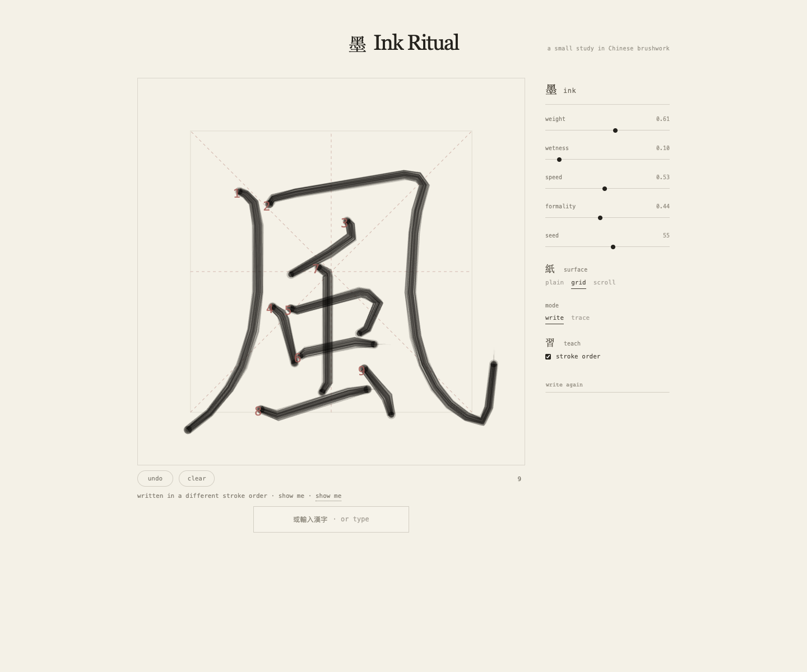

# Ink Ritual



**Ink Ritual** is a small, open-source browser study in Chinese brushwork. It turns stroke medians into layered brush fibers, then lets you replay, trace, tune, and draw the character yourself.

Try it on：<https://iiarius.github.io/ink-ritual/>

The project is intentionally quiet and local: one canvas, one character, a handful of brush parameters, and no backend.

## What it does

- Replays Chinese character strokes as a generative brush animation.
- Renders layered fibers, pooling, tapering, and dry-bristle terminals on a Canvas 2D surface.
- Lets you adjust `weight`, `wetness`, `speed`, `formality`, and `seed`.
- Switches between plain paper, practice grid, and scroll-like surfaces.
- Supports write and trace modes, stroke-order labels, replay, undo, and clear.
- Accepts another Han character and loads its stroke geometry on demand.
- Scores a hand-drawn stroke against the expected median and shows the latest percentage.

## Run locally

Requirements: Node.js `>=22.13.0`.

```bash
npm install
npm run dev
```

Open [http://localhost:5173](http://localhost:5173).

Useful commands:

```bash
npm run build   # production build
npm run start   # serve the production build
npm run lint    # check the source
```

## Deploy to GitHub Pages

Every push to `main` runs [`.github/workflows/deploy-pages.yml`](.github/workflows/deploy-pages.yml). It builds the static site with Vinext and publishes `dist/client` through GitHub Pages.

For the first deployment, set the repository's Pages source to **GitHub Actions** under `Settings → Pages → Build and deployment`. The live site is:

<https://iiarius.github.io/ink-ritual/>

## How it works

The default character `風` is stored locally in `app/ink-data.ts`. For another character, Ink Ritual requests the corresponding median paths from [`hanzi-writer-data`](https://github.com/chanind/hanzi-writer-data) through jsDelivr. The renderer keeps those paths in a 1,000 × 1,000 coordinate space and maps them into the canvas once, including the source data's bottom-left coordinate system.

The brush effect is deliberately procedural rather than a scanned font: each stroke is made from several offset fibers, a translucent body, pooled endpoints, and a small amount of seeded variation. That makes the same stroke reproducible while keeping it slightly alive.

## Project structure

```text
app/
├── page.tsx          # canvas renderer and interaction state
├── ink-data.ts       # local default character geometry
├── ink.module.css    # paper-like interface styling
├── globals.css       # minimal app-wide reset
└── layout.tsx        # metadata and document shell
public/
└── ink-ritual-screenshot.png
```

## Contributing

Small changes are welcome. Keep the interaction direct, preserve the restrained visual language, and prefer deterministic rendering when adding new brush behavior.

1. Create a branch.
2. Make one focused change.
3. Run `npm run lint` and `npm run build`.
4. Open a pull request with a screenshot or short explanation of the visual change.

## License

[MIT](LICENSE)
